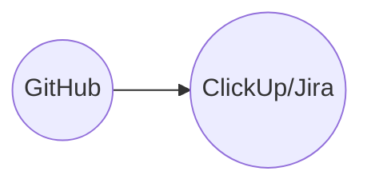

# Robotics-Computational_Intelligence
Repository for storing project code data
This will be the main repo to exchange code files and other data which requires version control


# Installing Ubuntu for Windows OS
1. Download a virtual machine such as VirtualBox or VMware
2. Download ubuntu 20.04 (Focal Fossa): https://releases.ubuntu.com/focal/
3. Install ubuntu in the virtual machine

# Setting up Git/GitHub
1. Download Git for either Mac/Windows: https://git-scm.com/downloads
2. Install Git 
3. Create a GitHub account 
4. Configure git: https://docs.github.com/en/get-started/getting-started-with-git/setting-your-username-in-git
5. Go to GitHub and fork this repository to your account: https://docs.github.com/en/pull-requests/collaborating-with-pull-requests/working-with-forks/fork-a-repo
6. Go to your GitHub account and look for the forked project
7. Clone the project to your code editor or local repository: https://docs.github.com/en/repositories/creating-and-managing-repositories/cloning-a-repository

# Contributing to this repository
1. Make small commits such that the loss of code is minimized
2. Once you are ready to contribute the changes -> commit to the local repo and
push the changes (create a pull request) 

# Installing ROS
[//]: # "!!! ROS only works on Ubuntu Focal"
!!! Important ROS Noetic work only on Ubuntu 20.04 Focal Fossa !!!
1. Install ROS on your machine following tutorial: http://wiki.ros.org/Installation/Ubuntu
2. Each new terminal requires following command for ros to work: "source /opt/ros/noetic/setup.bash" for convinience setup the bash with following command:
"echo "source /opt/ros/noetic/setup.bash" >> ~/.bashrc"


# Using ClickUp for Workflow Management 
-> Coming soon
Introduction to ClickUp: https://help.clickup.com/hc/en-us/articles/9563959684119-Set-up-your-personal-Workspace


# SSH + ROS Client/Server Setup

## SSH Setup

1. make sure that "bridged adapter" option is enabled in virtual machine settings

2. Connect to the same network

3. Make sure that OpenSSH Client is installed on your machine

4. Make sure that the OpenSSH Server is running on jetson with ```sudo systemctl status ssh```

4. To ensure that connection is established both ways, type ```ping <ip-address>``` on both machines, if not sure use ```hostname -I``` to identify the IP address

5. Connect to jetson using its ip adress and typing ```ssh jetson@jetson-ip-address``` command 

## Using ROS to Application

1. Chose on the machine to run roscore and run it 

2. connect to ssh using ```ssh <machine-name>``` on both machines

3. Make sure to specify the ip-address where the rosmaster is running from with ```ROS_MASTER_URI=http://ip-of-master-ros:11311```

4. Set ```export ROS_IP=<ip-address of machine>```  to ensure that the topic knows from where its information 

-> when running a node make sure that "export ROS_MASTER_URI=http://ip-of-master-ros:11311" is set aswell as "export ROS_IP=192.167.170.251"


-> Type hostname -I to get the ip adress of the jetson and connect to it using ssh jetson@jetson-ip-address command 

-> check the connection by typing who -a to see all ssh connections or by pinging the ip address both ways


## Setting Static IP address

-> Current static IP address is 192.168.1.100

1. Search for the ls /etc/netplan and find the configuration file 

2. Open the netplan file with sudo nano /etc/netplan/config_file.yaml

3. change the IP address in the line called "addresses" and apply the changes using sudo netplan apply

## AprilTag Setup for ROS

**Beachten!!!**:
 Das apriltag_ros repository nicht in den catkin workspace installieren, sondern über apt ros-noetic-apriltag-ros installieren

**Bedienung**

1. Im Terminal roscore starten 
2. Kamera einstellen mit roslaunch camera mono_can_rect.launch
3. Apriltagerkennung starten roslaunch apriltag_ros continuous_detection.launch 

