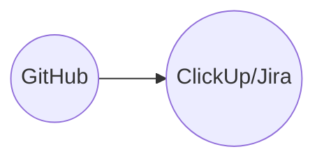

# Robotics-Computational_Intelligence
Repository for storing project code data
This will be the main repo to exchange code files and other data which requires version control

# Installing Ubuntu for Windows OS
1. Download a virtual machine such as VirtualBox or VMware
2. Download ubuntu 20.04 (Focal Fossa): https://releases.ubuntu.com/focal/
3. Install ubuntu in the virtual machine

# Setting up Git/GitHub
1. Download Git for either Mac/Windows: https://git-scm.com/downloads
2. Install Git 
3. Create a GitHub account 
4. Configure git: https://docs.github.com/en/get-started/getting-started-with-git/setting-your-username-in-git
5. Go to GitHub and fork this repository to your account: https://docs.github.com/en/pull-requests/collaborating-with-pull-requests/working-with-forks/fork-a-repo
6. Go to your GitHub account and look for the forked project
7. Clone the project to your code editor or local repository: https://docs.github.com/en/repositories/creating-and-managing-repositories/cloning-a-repository

# Contributing to this repository
1. Make small commits such that the loss of code is minimized
2. Once you are ready to contribute the changes -> commit to the local repo and
push the changes (create a pull request) 

# Installing ROS
[//]: # "!!! ROS only works on Ubuntu Focal"
!!! Important ROS Noetic work only on Ubuntu 20.04 Focal Fossa !!!
1. Install ROS on your machine following tutorial: http://wiki.ros.org/Installation/Ubuntu
2. Each new terminal requires following command for ros to work: "source /opt/ros/noetic/setup.bash" for convinience setup the bash with following command:
"echo "source /opt/ros/noetic/setup.bash" >> ~/.bashrc"

# Using ClickUp for Workflow Management 
-> Coming soon
Introduction to ClickUp: https://help.clickup.com/hc/en-us/articles/9563959684119-Set-up-your-personal-Workspace

# SSH + ROSClient/Server Setup

-> make sure to enable "bridged adapter" in the virtual machine box settings !!!!

-> Make sure that the machine you want to connect to jetson has openSSH client installed, so that the connection can be made between the machine and jetson 

-> use command sudo systemctl status ssh to make sure the server is running on jetson 

-> Type hostname -I to get the ip adress of the jetson and connect to it using ssh jetson@jetson-ip-address command 

-> check the connection by typing who -a to see all ssh connections or by pinging the ip address both ways